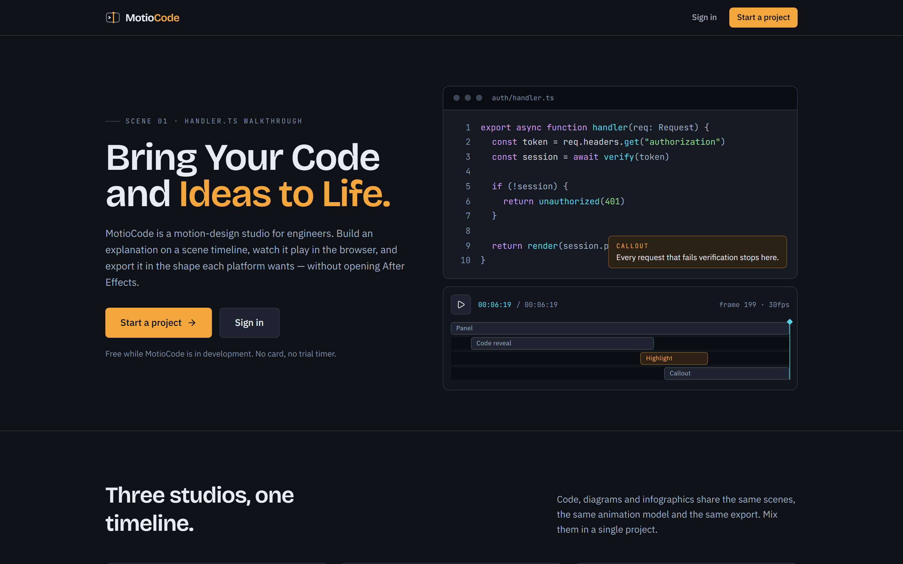

# MotioCode

**Bring Your Code and Ideas to Life.**

A motion-design studio for engineers. Build an explanation on a scene timeline,
watch it play in the browser, and export it as video — without opening After
Effects.

**[Live Demo](https://motio-code.vercel.app/)**



---

## What it does

Technical people usually understand the thing they want to explain and have no
way to animate it. MotioCode is aimed at that gap: a visual editor where a code
walkthrough, an architecture diagram or a metrics infographic is built on a
scene timeline and exported in the shape each platform wants.

Three studios share one project model, one animation model and one export path:

| Studio           | For                                                                                                              |
| ---------------- | ---------------------------------------------------------------------------------------------------------------- |
| **Code**         | Reveal a snippet line by line, hold on the line that matters, caption it in place.                               |
| **Diagrams**     | Lay services and connections out on a canvas, or write the definition as Mermaid text and let MotioCode draw it. |
| **Infographics** | Counters, bars, comparisons and step sequences that stay faithful to the numbers you typed.                      |

### The one idea everything rests on

**Every frame is a pure function of a frame number.** No CSS keyframes, no DOM
measurement, no animation state living in the browser. The editor canvas and the
video renderer draw the _same_ component tree from the same `(project, frame)`
pair — which is what makes a preview trustworthy, a timeline seekable, and a
render reproducible.

## Status

The MVP is built through Phase 4 and partway through Phase 5. It is a working
application, not a prototype: you can sign up, build a project from a template,
edit it, preview it and download an MP4.

| Phase                  |                                                                                                                           |
| ---------------------- | ------------------------------------------------------------------------------------------------------------------------- |
| 1 — Foundation         | ✅ Auth, dashboard, schema, project CRUD, editor shell                                                                    |
| 2 — Core editor        | ✅ Canvas, selection, scenes, properties, timeline, playback, undo/redo                                                   |
| 3 — Content modules    | ✅ Code, diagrams, infographics, presets, 10 starter templates                                                            |
| 4 — Preview and export | ✅ Remotion composition, browser preview, in-tab render, download                                                         |
| 5 — MVP polish         | 🟡 Duplication, export history, responsive, accessibility and E2E done; error handling, performance, deployment remaining |

#### Working today

- Email/password auth with verification and password reset, RLS on every table
- Dashboard with search, rename, duplicate and delete-with-confirmation
- 10 starter templates — code walkthrough, API request lifecycle, microservices
  architecture, cloud infrastructure, event-driven architecture, authentication
  flow, data pipeline, database query execution, before/after code comparison,
  technical concept infographic
- 11 element types across the three studios, 8+ syntax-highlighted languages
- Scene timeline with draggable, trimmable clips and frame-accurate scrubbing
- Mermaid-style text definitions for supported diagram types
- Browser preview via Remotion `<Player>`, and export to **MP4 or WebM** at
  **720p / 1080p / 1440p** in **16:9, 1:1, 9:16 or 4:5**
- Export history with job status
- Profile avatars: upload your own, or use Gravatar — which is declinable

#### Not built yet

Left out deliberately, per the phase plan: server-side rendering, AI assistance,
collaboration, sharing, teams and billing. GIF export is refused rather than
faked, because the browser encoder cannot produce one.

## Tech stack

- **Next.js 16** (App Router, Turbopack), **React 19**, **TypeScript** (strict)
- **Tailwind CSS v4** with `@theme` design tokens
- **Zustand** for editor state, **Zod** for every schema boundary
- **Remotion 4** for composition and rendering — see [Licensing](#licensing)
- **Supabase** — Auth, Postgres, Storage, Row Level Security
- **Vitest** + React Testing Library, **Playwright** + **axe-core**

## Getting started

### Prerequisites

- **Node 22+** and **pnpm 10** (`corepack enable` will pick up the pinned version)
- A **Supabase project** — the free tier is enough

### 1. Install

```bash
pnpm install
```

### 2. Configure

```bash
cp .env.example .env.local
```

Fill in `NEXT_PUBLIC_SUPABASE_URL` and `NEXT_PUBLIC_SUPABASE_PUBLISHABLE_KEY`
from your project's API settings. Only publishable values belong in this file —
the service-role key is never used in this codebase.

### 3. Apply the schema

Migrations live in `supabase/migrations/`, named the way the Supabase CLI names
them (`<utc-timestamp>_<name>.sql`).

```bash
supabase link --project-ref <your-project-ref>
supabase db push
```

Or paste each file into the SQL editor in order. They create the tables, the RLS
policies, and the storage buckets.

### 4. Run

```bash
pnpm dev
```

Open <http://localhost:3000>.

> Supabase enables email confirmation by default, so the first account needs its
> link clicked before it can sign in.

## Scripts

|                             |                                                     |
| --------------------------- | --------------------------------------------------- |
| `pnpm dev`                  | Development server                                  |
| `pnpm build` / `pnpm start` | Production build and serve                          |
| `pnpm test`                 | Unit and component tests                            |
| `pnpm test:e2e`             | Playwright, against a production build on port 3100 |
| `pnpm typecheck`            | `tsc --noEmit`                                      |
| `pnpm lint`                 | ESLint                                              |
| `pnpm screenshots`          | Regenerate the images in this README                |

## Testing

**763 unit and component tests** across 42 files, and **94 end-to-end tests**
covering route protection, redirect hardening, responsive layout and
accessibility.

The split is deliberate rather than habitual. Timeline maths, the animation
model, schema round-trips and the render plan are unit-tested because they are
pure. Route protection, layout, focus rings and colour contrast are end-to-end,
because jsdom has no layout engine and middleware only runs for a real request.

Accessibility is checked two ways: an axe sweep for breadth, and hand-written
specs for what is specific to this product — whether the skip link goes
anywhere, whether sign-in works without a pointer, whether a focused control is
visibly focused. Contrast is additionally asserted against the design tokens
parsed out of `globals.css`, so a token cannot silently regress.

The authenticated journey from the spec (create → edit → preview → save →
reopen → export) is covered too, but needs a throwaway account in `E2E_EMAIL` /
`E2E_PASSWORD`. Without it those specs **skip rather than fail** — a missing test
account should not look like a broken product.

## Architecture

[`docs/architecture.md`](docs/architecture.md) is the real documentation: what
each decision was between, and why it went the way it did. Worth reading before
changing anything in the render path, the schema, or the design tokens.

Layout:

```text
app/        routes (marketing, auth, authenticated app)
core/       the model — animation, diagram, editing, render, templates.
            Pure TypeScript, no React, no Supabase.
features/   feature UI — editor, preview, export, projects, profile
components/ shared primitives
lib/        Supabase clients, env, a11y and avatar helpers
supabase/   migrations
```

`core/` holds no framework imports on purpose: the project model outlives the UI
that edits it.

## Licensing

**Remotion is not MIT**, and this matters before you deploy anything.

It is free for individuals and organisations of **three people or fewer**,
including commercial use. Above that it requires a paid company licence —
"Remotion for Automators" is **$0.01 per render with a $100/month minimum**. The
trigger is the size of the legal entity, not whether the use is commercial.

The browser renderer also sends telemetry on every render, **including the end
user's IP address**, which cannot be disabled.

[`docs/decisions/remotion-licensing.md`](docs/decisions/remotion-licensing.md)
records the terms verbatim, with sources and the date they were read. Check them
against the current licence before relying on this summary.

Everything else in this repository is the author's own work.

## Deploying to Vercel

The app is a standard Next.js App Router project and needs no custom build step.
Set `NEXT_PUBLIC_SUPABASE_URL`, `NEXT_PUBLIC_SUPABASE_PUBLISHABLE_KEY` and
`NEXT_PUBLIC_SITE_URL` in the project's environment variables, and add the
deployed URL to Supabase's allowed redirect URLs so email confirmation links
come back to the right place.

Exporting runs **in the visitor's browser** via WebCodecs, so no render workers,
queues or GPU instances are involved — but it also means an export needs a
browser that supports it, and the tab has to stay open.
